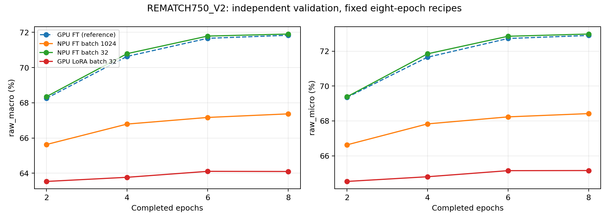

# REMATCH750_V2：大 batch 训练验证＋LoRA 收尾

状态：**已完成（2026-09-23）**。batch1024与LoRA关闭；条件触发的batch32八轮对照完成，保留为效率配置，未达新候选晋级门。三组执行审计通过，均无平台测量、无新提交包。RM-FT 平台 60.96570879179575%（22,828/37,444）仍为基准；RM-LT 为 60.885589146458706%。NPU 两轮验收包未上传，不能替代八轮结果。RM-FULL、OOF、flip/输入几何均保持关闭。

## 固定任务与实际启动

- NPU：`configs/rematch750_ft_npu_throughput.yaml`，只将 `log_every_steps` 200→20；SHA-256 `811cf823cf67e43d0f09960200090401c6bc41e2ce3b78f65d9334d4e0c63db4`。batch 1024、workers 40、prefetch 4、NPU pinned、fused AdamW、foreach norm、OMP 4，8/8 epochs/cosine，head 1e-4、visual 3e-6、CE 2轮后 GCE q=.5、anchor 2.0、shuffle。
- SSH 别名 `vllm-lqh-86`；容器 hostname 实测 `vllm-hust-lqh-21rc`。设备 0 为 910B2、无其他训练进程；PCI C1 本地 CPU 144–167，既有 taskset 144–191 均在允许列表（NUMA 6/7）。保留已选执行设置。
- NPU RM-LP 初始化 SHA-256：`d5cb8f5265754fd900d3efde23e24fefbcf616c747f2cab13e4dc2201fdd689b`。
- 首次传输受 Windows 命令行长度限制失败，旧文件短暂启动 PID 972277，已终止；原现场/日志保存在 `outputs/npu_tuning/*preobservability_aborted*`，不作为正式结果。分块传输并核对哈希、7 项 trainer 测试通过后，从 LP 新启正式 PID 973766。
- LoRA：本机与远端均未找到既有进程，本机无 RM_LORA 输出。用户明确授权重新开始；本机 GPU 从原 RM-LP 初始化，保持 `configs/rematch750_lora.yaml` 全部训练字段。后4层、rank8、alpha16、batch32、8轮、visual/LoRA LR2e-5。头部说明补列 warmup=1（FT=0）；不是低秩约束单变量对照。

```bash
# NPU，/workspace/noise；仅训练，不串接上传
source /usr/local/Ascend/cann-9.0.0/set_env.sh
export ASCEND_RT_VISIBLE_DEVICES=0 OMP_NUM_THREADS=4 PYTHONPATH=reproducibility/aegis_f1
taskset -c 144-191 /workspace/noise-npu-venv/bin/python -u -m aegis_clip.cli.rematch train --config configs/rematch750_ft_npu_throughput.yaml
# 本机 /home/lux1/noise
PYTHONPATH=reproducibility/aegis_f1 python3 -u -m aegis_clip.cli.rematch train --config configs/rematch750_lora.yaml
```

NPU 日志 `outputs/npu_tuning/v2_train.log`；LoRA 日志 `outputs/rematch750_v2/lora_train.log`；各 run 下 `logs/progress.jsonl` 记录分类损失、加权 anchor 损失、更新前 LR、裁剪前 gradient norm、AMP scale、实际 optimizer post-hook 更新数与累计训练秒数（不含验证、保存和初始化）。每20个 global step及每轮末尾记录 NPU；LoRA 保留200步频率。CE/GCE 切换的损失数值不跨定义比较。最终仍交叉核对 optimizer state 的真实 step，不能仅拿 batch 数充当成功更新数。

## 判据和数据口径

train_dev=133,815，val=14,880；训练支持度 <20/20–99/≥100 的类别数为 2/12/736，不能只按极值比推导尾部优先。

每两轮 raw_macro 主选模，raw_micro 同值破平。NPU 2/4/6/8轮预期成功更新262/524/786/1048，LoRA为8364/16728/25092/33456；以实测审计为准。相同8轮样本遍历并非相同优化器预算，不线性缩放LR、不延长轮数、不扫参数。

保留完整2/4/6/8曲线及选中checkpoint、逐类报告与重载检查。比较主表固定 candidate、selected_epoch、raw_macro、raw_micro、固定训练尾部75类macro、其余675类macro、成功更新数、训练耗时、真实平台分；模型各自最差75类单独解释。NPU与GPU的后端、optimizer实现和LP资产不同，不能把全部差值归给batch。

符合既有+0.20pp筛选门时生成候选包；接近基准且更快只记效率候选，不称统计等价。明显落后时不推广，必要时才做同哈希NPU LP初始化的既有batch32八轮对照；不自动派生LR或轮数扫描。非有限梯度/跳步/重载不一致先归执行问题，不作精度结论。无平台测量只写本地结果。

## 指标解释修正

OOF 文档原按验证图片占比换算尾部 macro 的分析已更正：类别均衡目标按固定75/750=10%计权，ΔA=.1ΔA75+.9ΔA675；约2.566pp尾部差的假设贡献约.257pp，不是平台预测，也不重开OOF。

## 验证记录

本地完整 Aegis：662 passed、7 skipped；2个失败均为已登记的 `test_scope_protocol.py` 旧阶段资产 `ScopePreflightError`。本机与NPU trainer 定向各7 passed。完整训练结果与执行审计见下文；测试通过与候选晋级分别记录。

## Batch 1024 完整实测

| Epoch | raw_macro | raw_micro | 成功更新数 | 累计纯训练秒数 |
|---|---:|---:|---:|---:|
| 2 | 65.6303% | 66.6263% | 262 | 236.486 |
| 4 | 66.7909% | 67.8293% | 524 | 468.730 |
| 6 | 67.1673% | 68.2325% | 786 | 702.929 |
| 8 | 67.3704% | 68.4207% | 1048 | 935.492 |

选中 epoch 8。固定尾部75类 macro **51.3293%**，其余675类 **69.1527%**。纯训练 **935.492s**（每轮平均 116.937s）；含初始化/验证/保存/重载与逐类导出的 CLI 区间 **1084.890s**（同机文件时间界定）。best/last optimizer step 均1048，scheduler/global step同值，模型张量有限，重载macro/micro精确一致。best SHA-256 `1f8042aac3327a2e3f3610186e490f9ad86d72247e34526b552362cc6f9e244c`。

相对 GPU RM-FT epoch8 macro **−4.4658pp**，明显落后且低于−2pp阈值。该固定八轮batch1024配置不晋级、不推广、不生成预测包；不是「1024在任何配方下一定不可用」的结论。完整审计见 `results/rematch750_v2_npu1024.json`；逐类和进度证据见 `results/rematch750_v2/npu1024_*`。远端checkpoint保留在 `/workspace/noise/outputs/npu_tuning/RM_FT_NPU_THROUGHPUT/seed42/checkpoints/{best,last}.pt`。

### 条件触发的小 batch 对照

因为完整八轮仍明显退化、需分清后端迁移与batch配方变化，依用户授权启动现有 `configs/rematch750_ft_npu_tuned.yaml` 完整8轮，PID 977695。启动前重新断言LP SHA与1024完全一致；配置差异只为实验ID、batch32、workers16、prefetch2、日志200。所有数据、loss、LR、schedule、优化器、AMP和推理字段一致；不从两轮验收checkpoint续训。命令与1024相同，只替换config路径。日志 `outputs/npu_tuning/v2_control32_train.log`，输出 `outputs/npu_tuning/RM_FT_NPU_TUNED/seed42/`。完整结果见下文「Batch 32 完整实测」。

## LoRA 完整实测（2026-09-23 收尾）

| Epoch | raw_macro | raw_micro | 成功更新数 | 累计纯训练秒数 |
|---|---:|---:|---:|---:|
| 2 | 63.5327% | 64.5296% | 8364 | 880.162 |
| 4 | 63.7678% | 64.7984% | 16728 | 1767.070 |
| 6 | 64.1064% | 65.1478% | 25092 | 2658.458 |
| 8 | 64.0981% | 65.1546% | 33456 | 3564.861 |

按既定 raw_macro、raw_micro 顺序选中 **epoch 6**；epoch8 micro虽略高，macro略低，不临时改选模。所选macro **64.1064%**、micro **65.1478%**，相对RM-FT macro **-7.7298pp**。固定尾部75类macro **47.4440%**，其余675类 **65.9577%**。全程33,456次成功更新，best自身为25,092步；last为epoch8/33,456步。纯训练 **3564.861s**，完整CLI区间 **3726.638s**。

本机训练进程exit=0。模型及optimizer张量有限，best重载macro/micro和逐类结果精确一致。best SHA-256 `43beab4b8637c0e3e0acf95e4162f66b30790fee95cba3eea72dda9f3ff2339f`，原GPU RM-LP初始化 SHA-256 `67a77e81d87a565e135d1dae30df001c7b543bfc872751d57f0e89b1e94d804a`。配置文件 SHA-256 `416a4daa8559b958bae4bdcaf0c3d06257b3a909b626a1b2885200db3982e69d`（只修正头部说明，训练字段保持原配方）。

决定：**该固定LoRA配方关闭，不生成提交包，不上传平台，不派生rank/层数/LR/batch扫描**。不能由单个结果声称「低秩约束本身损害泛化」：PEFT、LR与warmup均不同于FT。保留checkpoint `outputs/rematch750/RM_LORA/seed42/checkpoints/{best,last}.pt`、逐类报告和完整曲线供复核。审计 `results/rematch750_v2_lora.json`；逐类与进度证据 `results/rematch750_v2/lora_*`。

## 实现与重放审计

实现只增加训练观测：分类与加权anchor损失分开、更新前LR、裁剪前梯度范数、AMP scale、optimizer post-hook成功调用计数、累计训练计时与JSONL。没有修改loss、optimizer调用顺序、调度或采样。两套原配置经解析逐字段比较：1024只有日志200→20，LoRA仅注释差异。runtime trainer SHA-256与两路训练时的代码快照一致，见 `results/rematch750_v2/provenance.json`。

```bash
# 对每个完整run分别执行；NPU使用其venv并保持本机环境路径
OMP_NUM_THREADS=4 PYTHONPATH=reproducibility/aegis_f1 python3 scripts/audit_rematch750_v2.py --config configs/rematch750_lora.yaml --output results/rematch750_v2_lora.json
OMP_NUM_THREADS=4 PYTHONPATH=reproducibility/aegis_f1 /workspace/noise-npu-venv/bin/python scripts/audit_rematch750_v2.py --config configs/rematch750_ft_npu_throughput.yaml --output results/rematch750_v2_npu1024.json
OMP_NUM_THREADS=4 PYTHONPATH=reproducibility/aegis_f1 /workspace/noise-npu-venv/bin/python scripts/audit_rematch750_v2.py --config configs/rematch750_ft_npu_tuned.yaml --output results/rematch750_v2_npu32.json
# 本机取得三份审计记录后汇总
PYTHONPATH=reproducibility/aegis_f1 python3 scripts/report_rematch750_v2.py
```

审计JSON中的 `status=passed` 只表示执行/完整性审计通过；候选是否晋级以比较报告的 `decision` 为准。表中成功更新数是整个8轮run的总数；所选checkpoint自身的epoch和step另列在审计文件中。

## Batch 32 完整实测（2026-09-23 收尾）

| Epoch | raw_macro | raw_micro | 成功更新数 | 累计纯训练秒数 |
|---|---:|---:|---:|---:|
| 2 | 68.3531% | 69.3817% | 8364 | 669.913 |
| 4 | 70.7910% | 71.8481% | 16728 | 1327.397 |
| 6 | 71.7891% | 72.8562% | 25092 | 1995.682 |
| 8 | 71.9047% | 72.9839% | 33456 | 2670.460 |

选中epoch **8**；macro **71.9047%**、micro **72.9839%**，相对GPU RM-FT macro **+0.0685pp**，未达到+0.20pp晋级门。固定尾部75类macro **56.0729%**，其余675类 **73.6638%**。纯训练 **2670.460s**（每轮平均333.807s）；完整CLI区间 **2870.872s**。

配置SHA-256 `24eae620a592d2e4a0f1809ac9a29be65715ca597dfb88fdb92873af2de34ee7`；best SHA-256 `f324ea6d60a48ce9c524aafac939952007ee7582de50a328de38185955462606`。best/last均epoch8、optimizer/scheduler/global step均33,456；模型和optimizer张量有限，重载macro/micro及逐类结果精确一致。epoch2还与旧两轮调优验收macro、micro、逐类结果完全一致。两路NPU的LP初始化、train/val哈希与runtime trainer哈希均一致。审计 `results/rematch750_v2_npu32.json`；逐类/进度 `results/rematch750_v2/npu32_*`。checkpoint位于远端 `/workspace/noise/outputs/npu_tuning/RM_FT_NPU_TUNED/seed42/checkpoints/`。

同NPU配方对照：batch32最终macro比batch1024高 **4.5343pp**，纯训练耗时为其 **2.855倍**。对照恢复到GPU FT附近，未显示明显的后端迁移退化；不支持把1024的退化简单归咎于NPU。结论限于已选八轮固定配方，不能称1024普遍不可用、32是最优batch、或两后端统计等价。两NPU配置还存在workers/prefetch差异，不声称逐步随机增强完全一致。

决定：**保留 `configs/rematch750_ft_npu_tuned.yaml` 作为已完成八轮验收的NPU效率配置**；未达到+0.20pp新候选筛选门，不生成新提交包，不替代RM-FT平台成绩。关闭本轮，不自动派生LR、轮数、batch、LoRA或采样扫描。

## 最终比较与交付

| candidate | selected_epoch | raw_macro | raw_micro | 固定尾部75类 macro | 其余675类 macro | 成功更新数 | 纯训练秒数 / CLI总秒数 | 平台分数 |
|---|---:|---:|---:|---:|---:|---:|---:|---:|
| RM_FT | 8 | 71.8362% | 72.9032% | 55.5827% | 73.6421% | 33456 | 未记录 | 60.9657088% |
| RM_LT | 8 | 71.8655% | 72.6949% | 58.1485% | 73.3897% | 33456 | 未记录 | 60.8855891% |
| RM_FT_NPU_THROUGHPUT | 8 | 67.3704% | 68.4207% | 51.3293% | 69.1527% | 1048 | 935.5 / 1084.9 | 未测量 |
| RM_LORA | 6 | 64.1064% | 65.1478% | 47.4440% | 65.9577% | 33456 | 3564.9 / 3726.6 | 未测量 |
| RM_FT_NPU_TUNED | 8 | 71.9047% | 72.9839% | 56.0729% | 73.6638% | 33456 | 2670.5 / 2870.9 | 未测量 |

表内成功更新数均为完整run总数。LoRA选中epoch6（best=25,092步），但其完整run跑满8轮33,456步。FT/LT旧训练缺少同口径完整计时，留空；不拿历史短窗口速度填充完整耗时。固定尾部集合对五个模型一致，0.1×尾部macro+0.9×其余macro与整体macro在数值容差内一致。各模型自身最差75类不参与此固定集合比较。



机器可读汇总：`results/rematch750_v2/comparison.{json,csv}`。曲线包含GPU FT参考；LoRA的PEFT、LR与warmup不同，GPU/NPU的初始化资产和后端不同，不作单变量因果解释。

**可提交产物保留RM-FT原包**：`outputs/rematch750/RM_FT/seed42/submission/pred_results.csv` 与 `submission.zip`，37,444行、提交脚本全部通过、ZIP内CSV与外部逐字节一致。精确路径、SHA-256、校验命令与结果见 `results/rematch750_v2/retained_submission.json` 和 `retained_submission_check.log`。本轮不生成落败配方的预测包，不上传平台。平台基准仍60.96570879179575%（22,828/37,444）。

主要改动：`trainer.py`观测；1024配置日志频率、LoRA配置说明；`audit_rematch750_v2.py`和`report_rematch750_v2.py`；本执行记录、当前入口、README、NPU调优历史链接、FT/LT比较与OOF算术修正；`results/rematch750_v2*`审计/逐类/曲线/校验产物；`.gitignore`排除本轮临时运行日志目录。Git采用自动模式同步，验证后的改动提交推送到origin/main，在本轮交付检查点暂停。
